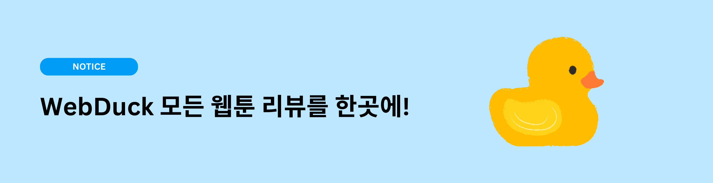
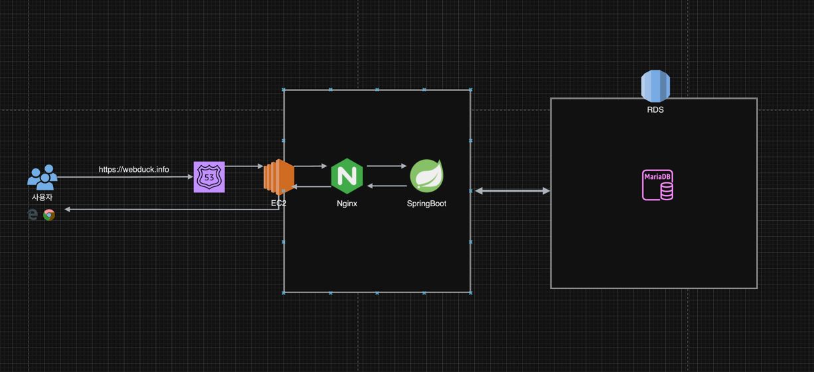
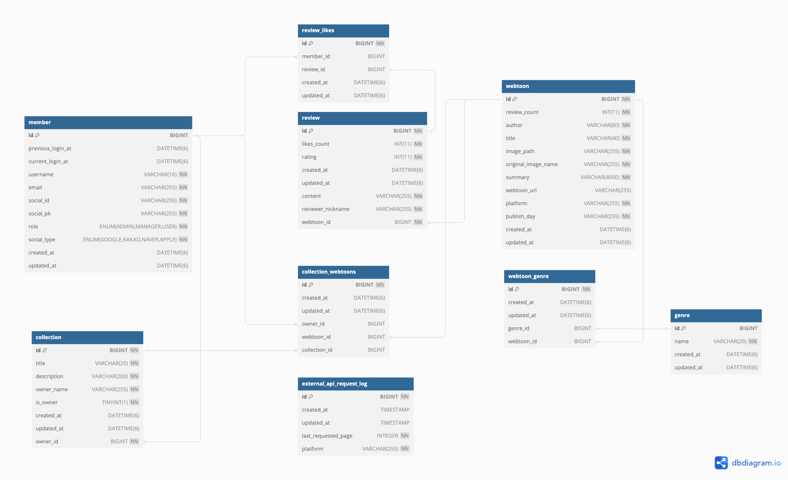
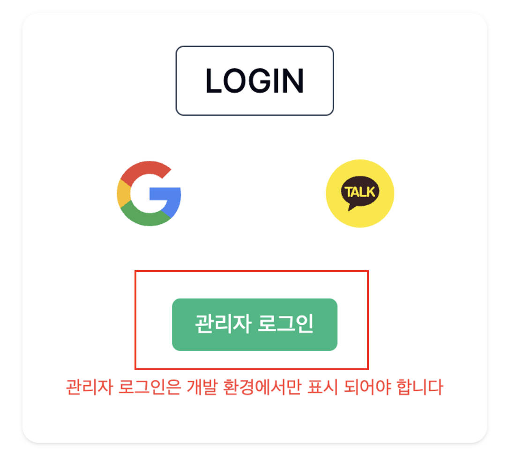
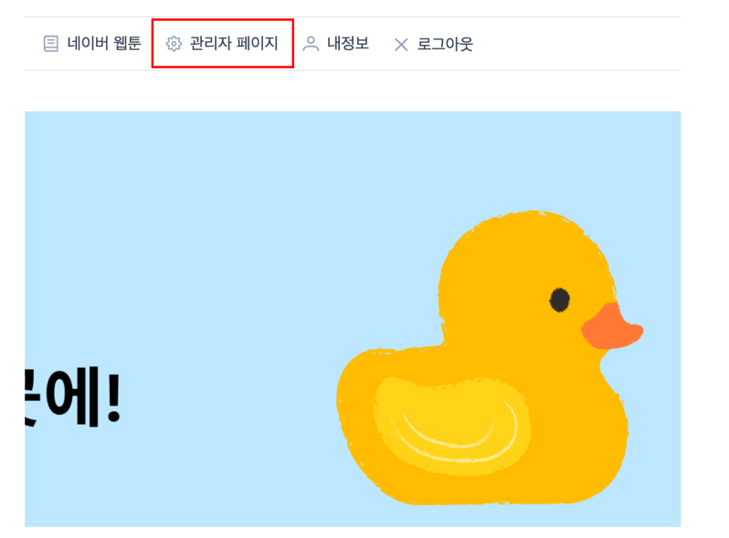

## 🧑🏻‍💻<a href="https://webduck.info">Webduck 방문하기</a>

---

## 📚웹툰 덕후들을 위한 사이트

--- 
플랫폼 별 리뷰가 달라 당황스러우셨나요?

요일마다 보시던 웹툰을 잊으셨나요?

---

## 🥸WebdDuck에서 웹툰관리하고 리뷰를 찾아보세요!
웹툰 리뷰평을 보고 보고싶은 웹툰을 <a href="https://webduck.info">WebDuck</a>에서 찾아봐요

나만의 보관함을 만들어 보던 웹툰을 기록하세요!

---

## 📝목차

- [기술스택](#기술스택)
- [아키텍처](#아키텍쳐)
- [ERD](#erd)
- [빌드](#빌드)
- [API 문서](#api-문서)
- [관리자 페이지](#관리자-페이지)
- [트러블슈팅](#트러블슈팅)

---

## 🔧기술스택


|                                                                                                                                                                                                                                                                           **BackEnd**                                                                                                                                                                                                                                                                           |         
|:---------------------------------------------------------------------------------------------------------------------------------------------------------------------------------------------------------------------------------------------------------------------------------------------------------------------------------------------------------------------------------------------------------------------------------------------------------------------------------------------------------------------------------------------------------------:| 
|     
|                                                                                                                                                                                                                                                                          **FrontEnd**                                                                                                                                                                                                                                                                           
|                                                                                                                                                                                                                                                                                                                                                                                                                                                           
|                                                                                                                                                                                                                                                                          **DataBase**                                                                                                                                                                                                                                                                           
|                                                                                                                                                                                                                                                                                                                                                                                                                                                       
|                                                                                                                                                                                                                                                                            **Infra**                                                                                                                                                                                                                                                                            |
|      
---


## 아키텍쳐


---


## ERD

---


---

## 빌드

| **도커 사용 시** |
|:-----------:|
```
docker compose up
```
### 접속
- 프론트엔드

    http://localhost:80

- 백엔드

    http://localhost:8090


<br/>

| **수동 빌드 시** |
|:-----------:|
### Vue
#### webduck/frontend
```java
vue run dev  // 개발환경
vue run build // 배포환경
```
### SpringBoot
#### webduck/backend
#### 환경 설정
```yaml
# webduck/backend/src/main/resources/application.yml
spring:
  profiles:
    active: dev // prod,test,docker

```


#### gradle
```java
./gradlew build
```

#### jar
```java
java -jar webduck/backend/build/libs/*.jar
```

### 접속
- 프론트엔드

  http://localhost:5173

- 백엔드

  http://localhost:8090

---

## API 문서
http://localhost:8090/docs/index.html

---

## 관리자 페이지


|  **도커 환경**   |  **http://localhost:80/login**  |
|:------------:|:-------------------------------:|
| **수동 배포 환경** | **http://localhost:5173/login** |

1. 관리자 로그인



<br/>


2. 상단 메뉴바 관리자 페이지 접속


<br/>

3. 메뉴 목록


---
## 📌트러블슈팅 & 성능 개선
- [외부 API 여러건 요청 성능 개선](https://velog.io/@minu1117/%EC%86%8D%EB%8F%84%EA%B0%80-%EB%8A%90%EB%A6%B0-%EC%99%B8%EB%B6%80-API-%EA%B0%9C%EC%84%A0%EA%B8%B0-1-Multi-Thread)
- [자주 조회되는 API 성능 개선](https://velog.io/@minu1117/Ehcache-%EB%A5%BC-%EC%9D%B4%EC%9A%A9%ED%95%9C-%EC%84%B1%EB%8A%A5-%EA%B0%9C%EC%84%A0ngrinder-%EB%AA%A8%EB%8B%88%ED%84%B0%EB%A7%81)
- [만능과 같은 서비스 레이어](backend/troubleshooting%20/서비스_레이어.md)
- [웹툰 데이터 통합 처리](backend/troubleshooting%20/웹툰_데이터_통합처리.md)
- [방대해지는 연관 관계](backend/troubleshooting%20/연관관계.md)
