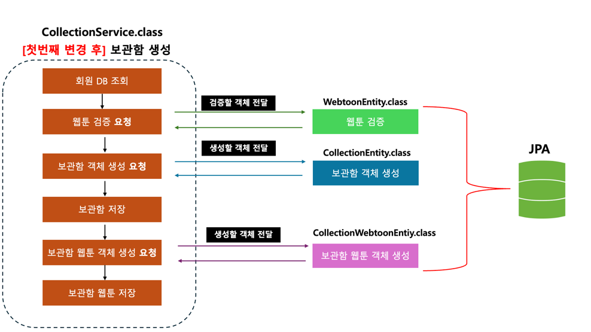
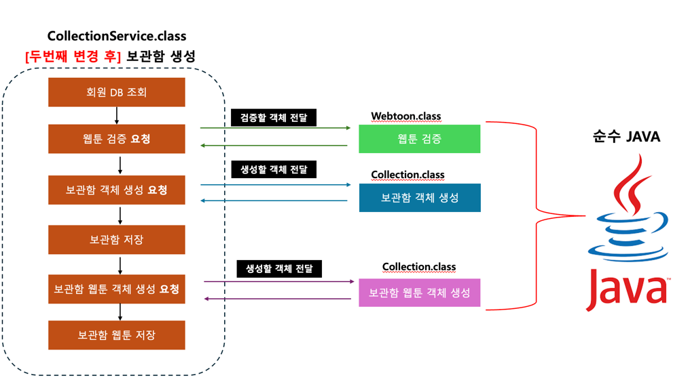

# 만능과 같은 서비스 레이어

---

## 고민
- 비즈니스, 검증, 객체간 협력하는 로직, DB 조회 생성 로직 등... 모든 로직들이 서비스 레이어에서 모두 실행되다 보니 마치 서비스 레이어가 만능과 같은 설계가 되었습니다.


---


## 서비스 레이어 문제점
#### 만능과 같은 서비스 레이어


> 아래 그림은 보관함 생성 로직 흐름입니다.
>
> 로직 흐름이 마치 절차 지향적 코드처럼 되어있고 CollectionService 에서 모든 로직 (DB 조회, 검증, 객체 생성, DB 저장) 을 실행합니다.


아래는 보관함 생성의 코드 입니다.
- CollectionService.class

```java
public class CollectionService {

    @Transactional
    public Collection create(SessionMember sessionMember, CollectionCreate collectionCreate) {

        Long memberId = sessionMember.getId();
        Member member = memberRepository.getById(memberId);

        // 요청한 웹툰ID 들이 DB에 있는지 검증
        // DB에 존재하는 웹툰 : req webtoons 검증
        List<Long> webtoonIds = collectionCreate.getWebtoonIds();
        int actualSize = webtoonRepository.findAllByIdIn(webtoonIds).size();
        int reqWebtoonSize = collectionCreate.getWebtoonIds().size();

        if (actualSize != reqWebtoonSize) {
            throw new CustomException(LogicExceptionCode.BAD_REQUEST);
        }

        // 컬렉션 생성
        Collection collection = Collection.builder()
            .title(collectionCreate.getTitle())
            .description(collectionCreate.getDescription())
            .ownerName(member.getUsername())
            .ownerId(member.getId())
            .isOwner(true)
            .build();

        collectionRepository.save(collection);

        // 컬렉션 웹툰 생성
        List<CollectionWebtoons> collectionWebtoons = new ArrayList<>(reqWebtoonSize);

        for (Long webtoonId : collectionCreate.getWebtoonIds()) {
            CollectionWebtoons colWebtoons = CollectionWebtoons.builder()
                .ownerId(memberId)
                .webtoonId(webtoonId)
                .collectionId(collection.getId())
                .build();

            collectionWebtoons.add(colWebtoons);
        }

        collectionWebtoonsRepository.saveAll(collectionWebtoons);
        return collection;
    }
    
    // ... 그 외 코드들
}
```


이런 식으로 서비스 레이어 에서 DB 조회, 검증, 객체 생성, DB 저장등 모든 로직을 하다보니 마치 서비스 레이어가 만능과 같은 레이어가 되어버렸습니다.

---
## 첫 번째 리팩토링
#### JPA Entity 클래스로 비즈니스 로직 이동

```java

@Entity
public class Collection extends BaseTimeEntity {
   
    //..  컬럼 코드들   
    
    // 생성
    public static Collection from(Member member,CollectionCreate collectionCreate) {
        return Collection.builder()
            .title(collectionCreate.getTitle())
            .description(collectionCreate.getDescription())
            .ownerName(member.getUsername())
            .ownerId(member.getId())
            .isOwner(true)
            .build();
    }

    // 보관함 작성자
    public static void flagAuthor(Member member, List<Collection> collections) {
        Long memberId = member.getId();
        for (Collection collection : collections) {
            if (collection.getOwnerId().equals(memberId)) {
                collection.setOwner();
            }
        }
    }

    // 보관함 주인인지 검증
    public void validateOwner(Member member, Collection collection) {
        if (!collection.getOwnerId().equals(member.getId())) {
            logger.error("member id and requested member id are different");
            throw new CustomException(LogicExceptionCode.BAD_REQUEST);
        }
    }

    // 그 외 업데이트, 작성자 설정 코드들..
    
}
```

첫 번째 해결방식은 Entity 클래스 안에 비즈니스 로직을 넣음으로 써 아래와 같은 흐름으로 리팩토링을 했습니다.



> 서비스 클래스는 단지 객체를 받아 DB조회 하거나 객체를 다른 클래스로 전송하고, 가공된 객체를 받아와 DB에 저장하는 방식으로 변경되었습니다.
> 
> 즉 서비스 클래스는 DB 조회, 요청, 가공된 데이터를 DB에 저장만 합니다.
> 
> 객체 지향적으로 코드는 리팩토링 되었으나 이번엔 Entity 클래스가 방대해짐을 느꼈습니다.

---

## 두 번째 리팩토링
#### - 엔티티 클래스와 도메인 클래스 분리

#### CollectionEntity.class

```java
// 엔티티 클래스
@Entity
public class CollectionEntity extends BaseTime {
    @Id
    @GeneratedValue(strategy = GenerationType.IDENTITY)
    @Column(nullable = false)
    private Long id;
    
    // 비즈니스 로직 도메인 클래스로 이동
    
    // 그 외 필드값들...
}
```

아래 클래스는 순수 JAVA 로만 이루어진 도메인 클래스 입니다.
#### Collection.class
```java
// 도메인 클래스
public class Collection {

    private Long id;
    private String title;
    private String description;
    private Long ownerId;
    private String ownerName;
    private boolean isOwner;
    
    
    // 비즈니스 로직
    public static Collection from(Member member,CollectionCreate collectionCreate) {
        return Collection.builder()
            .title(collectionCreate.getTitle())
            .description(collectionCreate.getDescription())
            .ownerName(member.getUsername())
            .ownerId(member.getId())
            .isOwner(true)
            .build();
    }
    
    // 그 외 검증,수정 등 비즈니스 로직...
    
}

```

#### CollectionService.class

```java

// 변경된 서비스 레이어
public class CollectionService {
    
    public Collection create(){
        // 변경된 점1 : 도메인에서 검증
        List<Long> reqWebtoonSize = collectionCreate.getWebtoonIds();
        List<Webtoon> actualWebtoons = webtoonRepository.findAllByIdIn(reqWebtoonSize);
        Webtoon.validateWebtoonIds(actualWebtoons, reqWebtoonSize);

        // 변경된 점2 : 도메인에서 객체 생성
        Collection collection = Collection.from(member, collectionCreate);
        collection = collectionRepository.save(collection);

        // 컬렉션 웹툰 생성
        List<CollectionWebtoons> collectionWebtoons = new ArrayList<>(reqWebtoonSize.size());

        // 변경된 점3 : 도메인에서 객체 생성
        for (Long webtoonId : collectionCreate.getWebtoonIds()) {
            CollectionWebtoons colWebtoons = CollectionWebtoons.from(memberId, webtoonId,
                collection.getId());
            collectionWebtoons.add(colWebtoons);
        }
    }
    
}
```

비즈니스 로직을 도메인 클래스로 분리함에 따라 아래와 같은 흐름으로 변경되었습니다.


---
## 느낀 점
> 이렇게 클래스를 나눔으로써 엔티티 클래스(CollectionEntity)는 데이터베이스의 테이블과 맵핑되는 구조에 집중하고, 도메인 클래스(Collection)는 비즈니스 로직을 처리하는 책임을 갖음으로써 각각의 책임 표현이 명확해졌습니다.
> 
> 또한 도메인 모델은 순수 자바 코드로 이루어져 있으므로 단위 테스트 작성이 쉬워졌습니다.
> 
> 하지만 도메인 클래스를 위한 클래스를 따로 만들어야 하기 때문에 생산 비용이 늘어난다는 점이 있습니다. 그래도 장기적으로 봤을 때, 가독성과 유지 보수성이 좋아짐을 느꼈고 프로젝트 아키텍처에 대해 이해심이 늘어났던 경험이었습니다.


