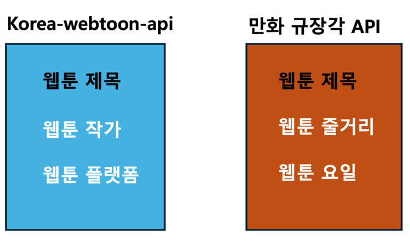
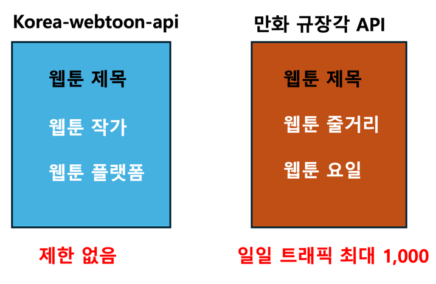
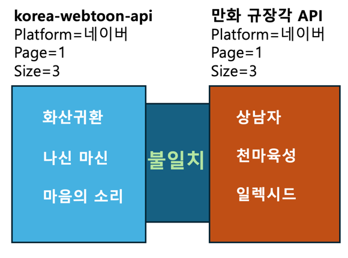
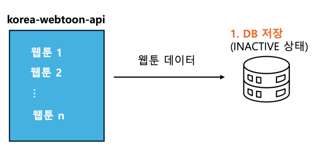
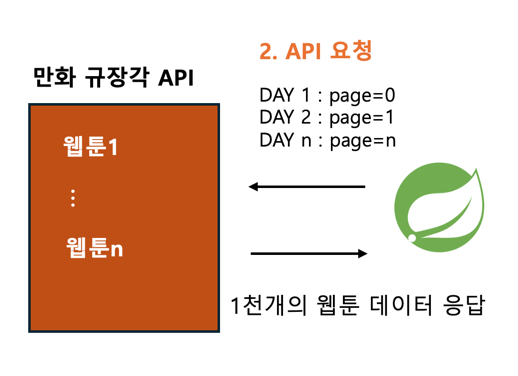
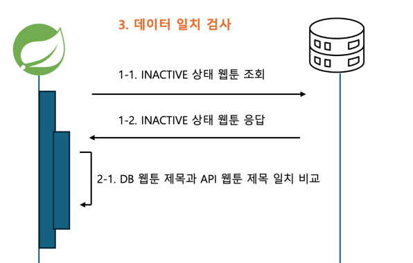
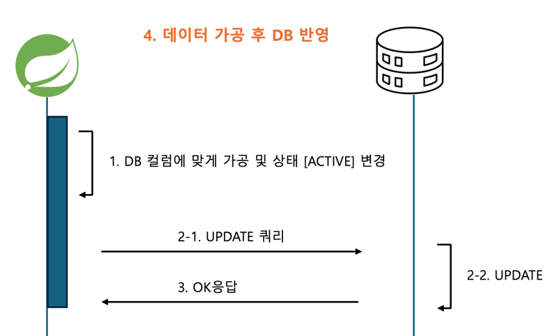
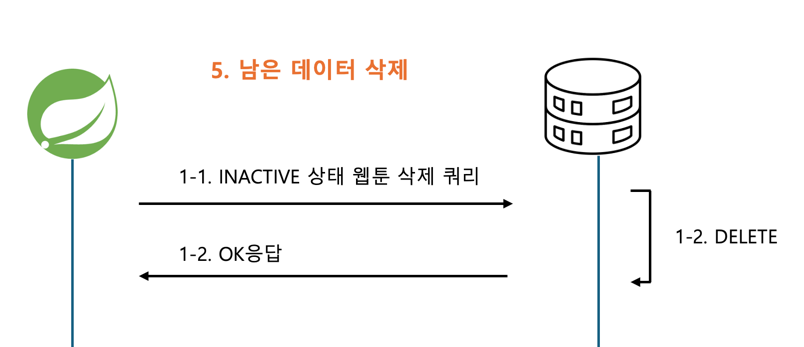

# 웹툰 데이터 통합 처리에 대한 고민

---

## 고민 배경
- 웹툰 데이터 구성 도중 초반엔 수작업으로 일일이 웹툰 데이터를 가져와 저장함
- 비효율적인 거 같아 크롤링을 하려 했으나 모두 robots.txt disallow였음
- 웹툰 open api를 사용하기로 함

## 고민

> Korea Webtoon API와 만화 규장각 Open API를 이용해 DB에 저장하려는 과정 중에 아래와 같은 문제점이 발생해 어떻게 처리할 것인지에 대해 고민이었습니다.

### 문제 상황 
1. 각 Open API 서비스별 제공해주는 웹툰 정보 형식이 다름. 그러므로 필요한 부분만 추출해야 함

2. Korea Webtoon API는 트래픽 제한 없이 요청할 수 있고, 만화 규장각 API는 하루 최대 1,000개의 요청만 요청할 수 있음

3. 페이지별로 제공되는 데이터가 서로 다름 

---

## 생각한 해결 방안

#### 1. 저장 후 상태 값 지정
트래픽 제한이 없는 Korea Webtoon API 의 모든 웹툰 데이터를 [INACTIVE] 상태로 DB에 저장

#### 2. 1천건 데이터 요청
만화 규장각 API 1천개 데이터 요청

#### 3. 데이터가 동일한지 비교
1. DB에 저장된 [INACTIVE] 상태인 웹툰 데이터를 조회

2. DB웹툰 제목과 API 웹툰 제목이 동일하지 비교

#### 4. 데이터 가공 후 DB 반영
제목이 일치한 웹툰 데이터 가공 후, DB에 수정한 웹툰 데이터 반영

#### 5. 위 1번부터 4번 과정을 만화 규장각 API의 응답데이터가 0일때까지 반복

#### 6. 남은 데이터 삭제
만화 규장각에 있는 모든 API를 요청했음에도, 여전히 DB에 남아있는 INACTIVE 웹툰 삭제

